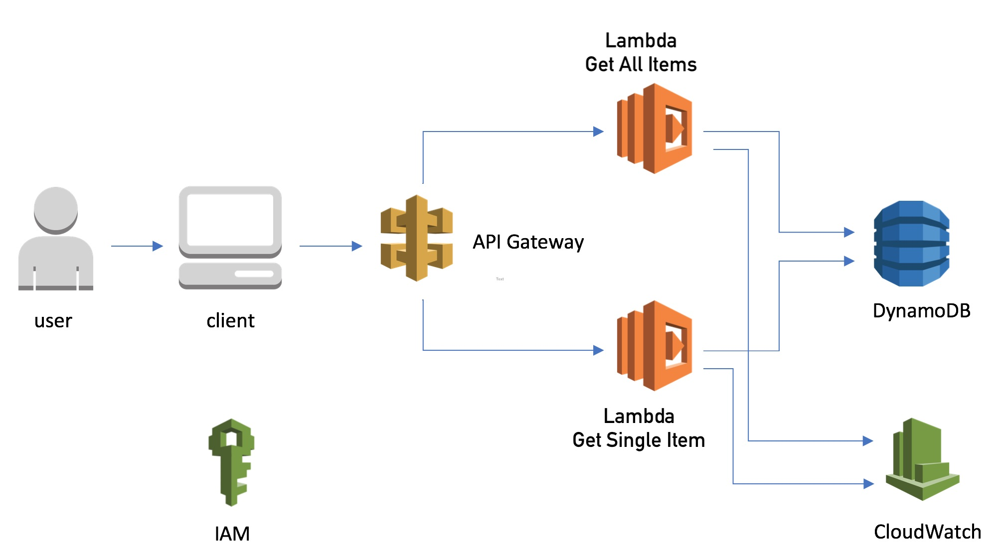

# serverless-api-dynamodb

Using the AWS Serverless Application Model (SAM) this solution deployes a serverless RESTful API in your AWS account that will return data from a DynamoDB table using Lambda functions as the compute engine. 

When you successfully launch the ASM template, the following resources will be provisioned:

- Amazon API Gateway with multiple stages including dev and prod 
- DynamoDB table with a primary key attribute "id" type string
- Two Lambda functions in Node.js 
- CloudWatch Log Groups for the two Lambda functions, with a retention policy of 30 days
- Lambda execution IAM Role with trimmed IAM actions to support solution actions

# deployment instructions

- Create an S3 bucket to host the Lambda functions code
- Zip and upload the Node.js code to the S3 bucket
- Launch the SAM template from the CloudFormation console (or any suported mechanism)
- The SAM template reuires two input parameters:
- Enter the name the S3 bucket containing the uploaded code zip file
- Enter the path/file name of the zip file
- Wait for sucessful deployment of the SAM template
- Once the DynamoDB table is deployed, create test items. id=1, id=2, id=3.

# Test instruction 

NOTE: Your API url will be different from the example's

- From a browser, if you invoke the prod API url with the "/resource" path:

      - Example: https://abcdefg.execute-api.us-east-1.amazonaws.com/prod/resource

      - The API will return all items in youe DynamoDB table: 

              {"id":{"S":"2"}}{"id":{"S":"1"}}{"id":{"S":"3"}}

- If you invoke the prod API url using the "resource/3" path:

      - Example: https://abcdefg.execute-api.us-east-1.amazonaws.com/prod/resource/3

      - The API should return the following single item:

            {
              "Item": {
                "id": {
                  "S": "3"
                }
              }
            }

